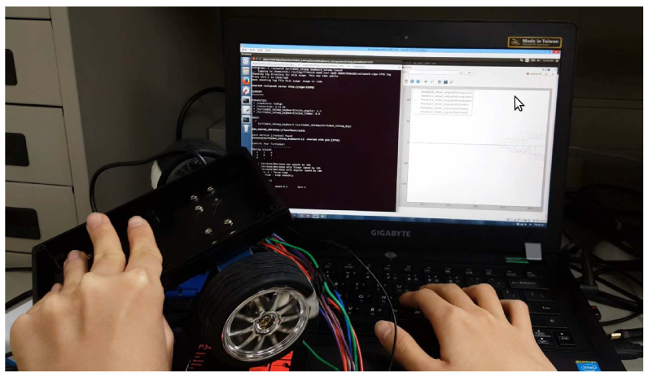

# ROS_small_car_project

## Overview
This project show how to use ROS communicate with STM mcu for sending velocity command  
to mcu with two motors controlled by PI velocity controller.  
In order to check the control performance of motors, we send the control result of velocity  
back to ROS and using rqt_plot to compare with the command input and control output.  
Furthermore, the communication between ROS and STM can use USB to TTL device to achieve  
wireless transmission.

## Prerequisite
1. rosserial_mbed  

2. rosserial package  

3. turtlebot_teleop package

## Install rosserial package
sudo apt-get install ros-indigo-rosserial  

cd catkin_ws/src  

git clone https://github.com/ros-drivers/rosserial.git  

cd catkin_ws  

catkin_make

## Install turtlebot_teleop package
sudo apt-get install ros-indigo-turtlebot-teleop  

roscd turtlebot_teleop  

sudo chmod 777 launch  

roscd turtlebot_teleop/launch  

sudo chmod 777 keyboard_teleop.launch  

gedit keyboard_teleop.launch  

remap from="turtlebot_teleop_keyboard/cmd_vel" to="cmd_vel"

## Run the total project
1. Insert the USB device of STM into PC  

2. sudo chmod 777 /dev/ttyACM0  

3. roslaunch ldscbot ldscbot.launch  

4. roslaunch turtlebot_teleop keyboard_teleop.launch  

5. rqt_plot /feedback_wheel_angularVel/linear /feedback_wheel_angularVel/angular

## Result
**rqt_plot show the command input and control output**
<tr>
<td>

</td>
</tr>

**remote control by using USB to TTL device**
<tr>
<td>

</td>
</tr>
